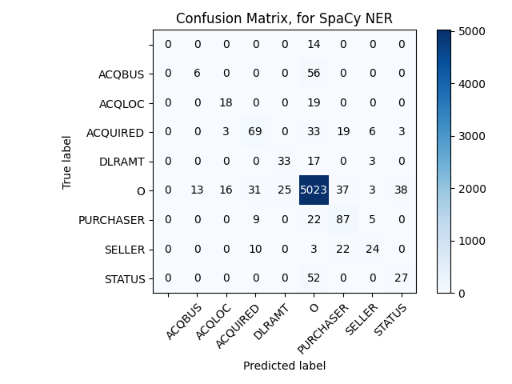

# CS 6340 NLP Project

This repo contains code for the information extraction system for the domain of corporate acquisition events.

## Running

```python
# To run this code, execute this code in your terminal with the doclist being replaced by the text file that lists the files to be processed.

python3 extract.py <doclist>
```

## Method
The method employed is a machine learning model using custom word vectors and spacy for training the model.

Custom word vectors were created using [Gensim's Word2Vec](https://radimrehurek.com/gensim/models/word2vec.html)

## Creating the Model
1. Generate the custom word vectors using the file: ``` generating_word_vectors.py```.
    - This file loads all of the data from ***/data/development-docs*** and creates word vectors from the accumulation of these files.  Word vectors should be in a format akin to: ```[['This', 'is', 'a', 'word', 'vector']['hello', 'world]]```
    - Stop words are removed from this dataset as well as some specifically for our corpora such as "Reuter"
    -  ```build_training_data()``` allows you to construct a json file in the aforementioned format while ```training()``` will train a custom model based on this custom word vector
    -  Within the ```training()``` method there are a number of parameters that have been constructed to assist with the training method ensuring that we are not over-fitting to our data.  If interested, please look at the (docs)[https://radimrehurek.com/gensim/models/word2vec.html], specifically the parameters section for a full explanation of what each one does.

2. Generate the training/validation/testing split using the file: ``` generating_training_data.py```.
   - This file loads all of the data from ***/data/development-docs*** and ***/data/development-anskeys*** and creates the annotated training/validation/testing data given the answer key and where the answer is found within the document.
   - If there are more than one answers (Hana Corp / HANA CORP) the script attempts to match based on lowercase and if the answer is the exact same (as would be the case here) we only append one answer to the list of entities.
   - The training/validation/testing split used is 300/50/50 and the data is randomized before splitting it up into these sections to avoid the model learning order
   - The format for all of these data files looks like this:
    ```[['This is the text of the sentence.',{'entities': [0, 4, BEGINNING],[25, 32, ENDING]}]['New sentence.',{'entities'}: [0,3, BEGINNING]]]```

3. Create a blank model using the terminal command: 
   ```bash
   python3 -m spacy init vectors en [LOCATION OF CUSTOM WORD VECTOR] [LOCATION WHERE YOU WANT THIS BLANK MODEL] --name [NAME OF MODEL]
   ```
   In my case, the command that I use is this:
   ```bash
   python3 -m spacy init vectors en word2vec/word2vec_aq_ner_model_00.txt models/01 --name en_test
   ```

    *Note: I encountered some errors running this previously since I hadn't created the directory I wanted to place everything in.  Please be sure to delete old models (i.e. if you have a model in models/01 delete that entire folder and just run the command after that)*

4. Train the blank model using the ```train_model.py``` script.
   -This file contains an incredibly simple file that loads the blank spacy model (that was trained on the custom word vectors) and adds an ***NER*** to the pipeline.
   -At this stage, feel free to add any other pipes you want to the pipeline.

5. Train the NER model using the terminal command: 
   ```bash
   python3 -m spacy train [CONFIG FILE OF MODEL] --output [WHERE YOU WANT THE NEW MODEL] --paths.train [FILEPATH FOR TRAIN DATA] --paths.dev [FILEPATH FOR VALIDATION DATA] --paths.vectors [PATH OF INITIAL MODEL]
   ```
   In my case, the command that I use is this:
   ```bash
   python3 -m spacy train models/01/config.cfg --output models/02 --paths.train aq_train.spacy --paths.dev aq_valid.spacy --paths.vectors models/01
   ```
   *Note: This will take some time since it'll go through and run different epochs attempting to find the best model available while training*

6. Test the model using the ```test_model.py``` script to create a confusion matrix. 
   - This is a really big problem with this model since it's not able to handle co-references.
   - This may not work if the testing data has overlapping values for entities (i.e. if coffee is part of ACQBUS and AQUIRED).  I had to delete these from the testing data to be able to see the results.
  
If you have no issues running the script or modifying the test data, you should see something like this:



## F-Score Analysis

## Discussion